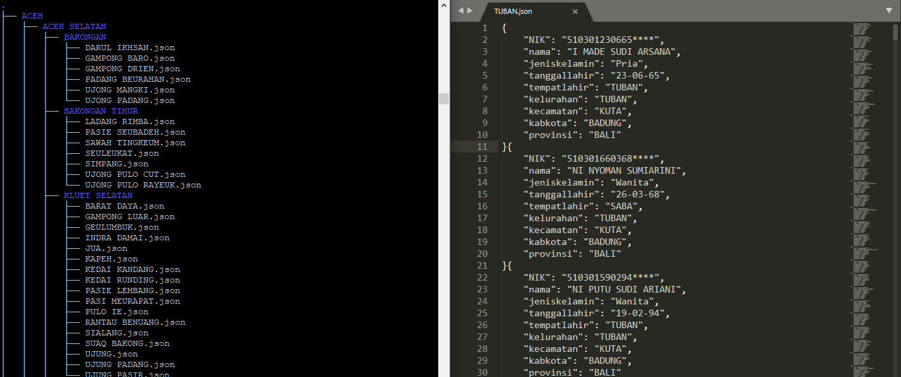

# DataID

Script PHP untuk mengambil Data Penduduk (usia 17 tahun keatas yang terdaftar menjadi pencoblos Pilkada 2018) dan menyajikan dalam format json.

### Require
 - php-curl

### Usage
Buat direktori/folder baru bernama `priv` pada direktori/folder yang sama atau ganti variabel `$dir` untuk menyimpan hasil di tempat sesuai keinginan.

```php grab.php```



Based on cURL and looping